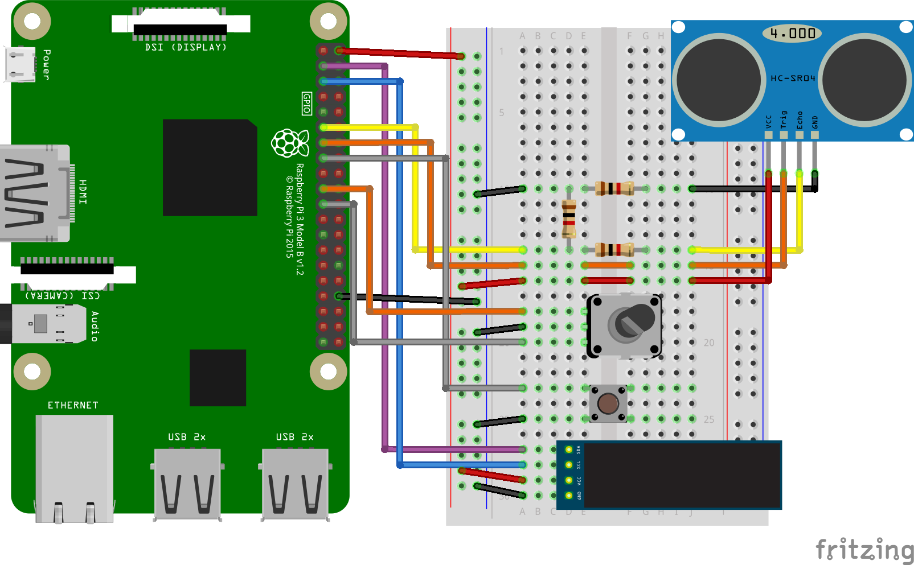

# HC-SR04 ultrasonic distance sensor midi instrument

HC-SR04 ultrasonic distance sensor midi instrument with Raspberry Pi which mimics a theremi. 

It plays dozens of instruments from a fluidsynth soundfont including pianos, guitars, percussion instruments and a variety of uncommon instruments and non musical sounds. Requires fluidsinth and a few python modules if you don't have them already, including rtmidi and sf2utils. The ssd1306 oled screen shows which note is playing. The pushbutton and the rotary are used to change instrument, octave, volume and scale (Minor, Major, Chromatic and Dorian)

